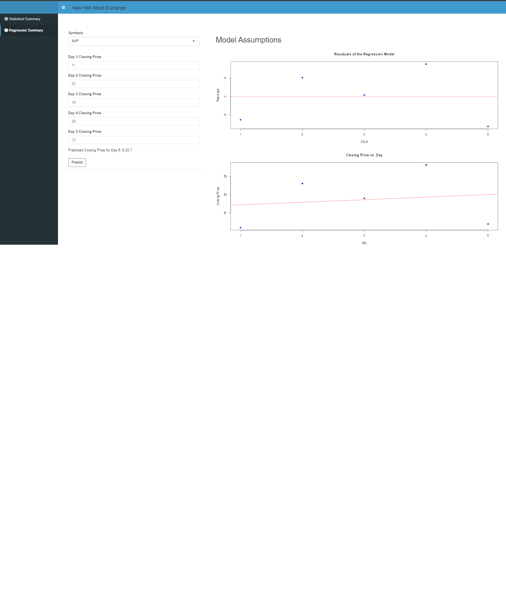

# NY_StockExchange_Analysis
Statistical and regression analysis of NYSE stock prices (2010-2016) with R Shiny dashboard. Includes candlestick charts, predictive modeling, and comprehensive statistical summaries.

# NYSE Stock Analysis Dashboard

  


## Overview
An interactive R Shiny dashboard for analyzing New York Stock Exchange (NYSE) data (2010-2016) with:
- Statistical summaries (mean, median, confidence intervals)
- Candlestick price visualization
- Regression modeling for price prediction
- Model diagnostics and validation

## Features
- **Statistical Analysis Tab**:
  - Company selection dropdown
  - Date range filtering
  - Descriptive statistics (mean, median, SD)
  - Histograms and boxplots
  - Interactive candlestick charts

- **Regression Analysis Tab**:
  - 5-day price input for predictions
  - Linear regression modeling
  - Model diagnostics (residual plots)
  - Next-day price prediction

## Dataset
Data sourced from [Kaggle NYSE Dataset](https://www.kaggle.com/datasets/dgawlik/nyse) containing:
- `prices.csv`: Daily prices (2010-2016)
- `prices-split-adjusted.csv`: Split-adjusted prices
- `securities.csv`: Company sector information
- `fundamentals.csv`: SEC 10K metrics (2012-2016)

## Installation
1. Clone repository:
   ```bash
   git clone https://github.com/yourusername/nyse-stock-analysis.git
